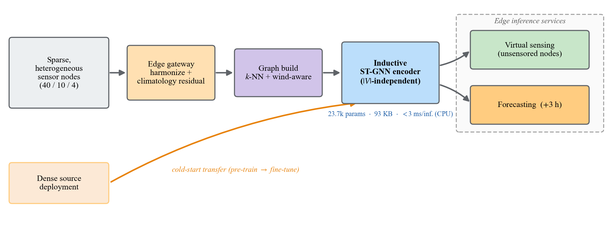
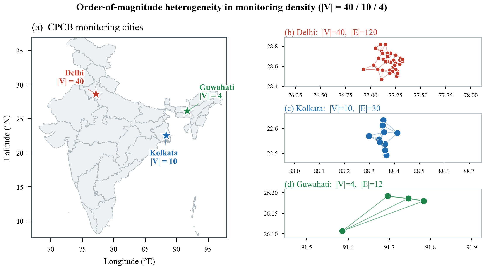
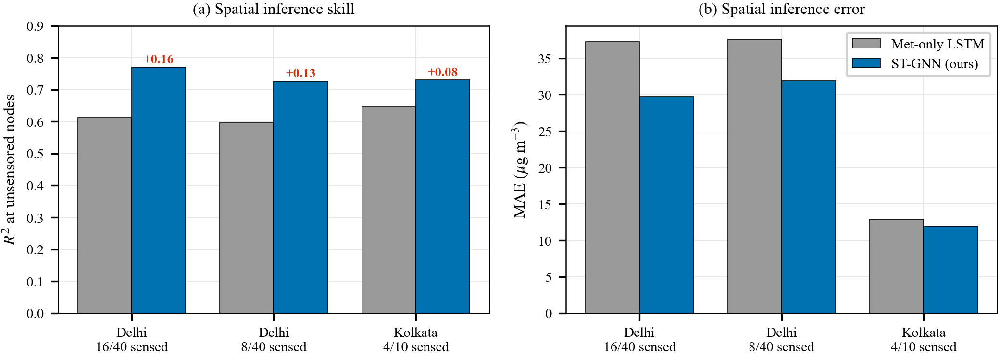
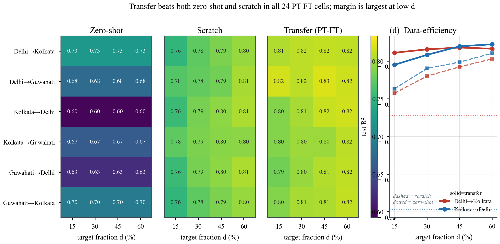
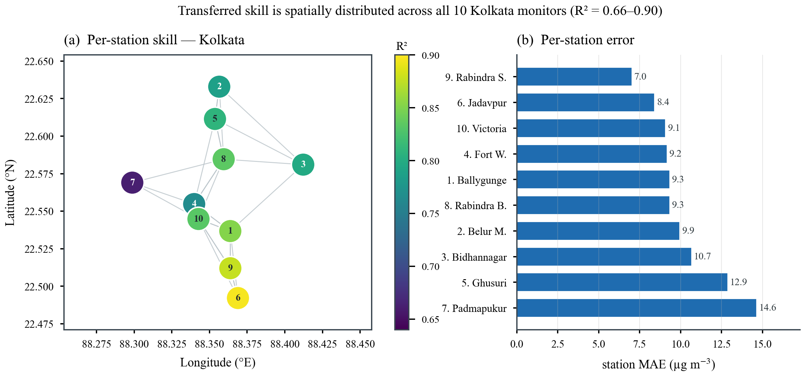
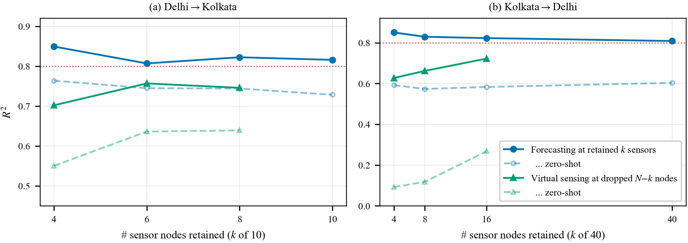
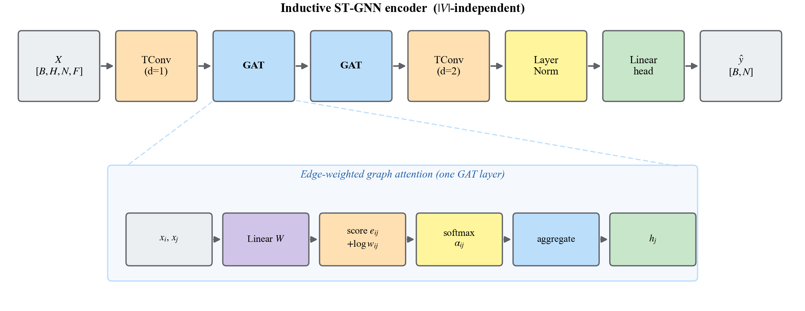
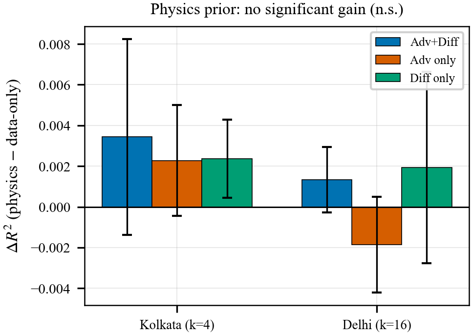

# Optimizing Sparse IoT Networks via Virtual Sensing and Cross-Deployment Transfer

**Virtual sensing and cross-deployment transfer for PM2.5 monitoring, benchmarked on real CPCB air-quality networks of 40, 10, and 4 sensor nodes.**

A single inductive, node-count-independent spatio-temporal GNN — **~24k parameters, 93 KB, <3 ms/inference on a commodity CPU core** — that stretches a small sensor budget three ways, plus an honest accounting of where the graph does *not* help. Extends a B.Tech thesis on LSTM transfer learning into a peer-reviewed IEEE Internet of Things Journal submission.



---

## Contents

- [The problem](#the-problem)
- [At a glance](#at-a-glance)
- [How it is solved — three levers on one model](#how-it-is-solved--three-levers-on-one-model)
- [Inside the encoder](#inside-the-encoder)
- [Honest negatives and robustness checks](#honest-negatives-and-robustness-checks)
- [Tech stack](#tech-stack)
- [Repository layout](#repository-layout)
- [Setup](#setup)
- [Reproducing the experiments](#reproducing-the-experiments)
- [Data access](#data-access)
- [License and usage](#license-and-usage)
- [Citation](#citation)

---

## The problem

The value of an IoT sensing deployment rests on the spatial density of its sensors, yet density is exactly what is expensive to provision and maintain. Real reference networks are therefore **sparse and heterogeneous**: the public CPCB CAAQM deployments studied here span an order of magnitude in size — **Delhi 40, Kolkata 10, Guwahati 4 nodes**, at three very different average inter-station spacings (4.4 km, 4.1 km, and 12.0 km respectively).



The operative engineering question is not *which model forecasts best given abundant data*, but **how few physical sensors a deployment needs**, and how much of the cost of additional nodes can be displaced into software. PM2.5 is the measured signal (a leading health risk), but the **sensing constraint** — not the pollutant — is the subject of this work; the methods are signal-agnostic and transfer to any sparse spatio-temporal IoT sensor network.

## At a glance

| | |
|---|---|
| **Model footprint** | 23,745 parameters · 92.8 KB on disk · CPU-only |
| **Inference latency** | 1.5 ms (N=4) → 1.7 ms (N=10) → 2.6 ms (N=40) per batch, single CPU core |
| **Same checkpoint runs on** | 4-, 10-, and 40-node graphs, verbatim, no retraining |
| **Virtual sensing (unsensored nodes)** | R² 0.73–0.77, beating a met-only LSTM by **+0.08 to +0.16 R²** |
| **Cold-start transfer** | Beats zero-shot *and* from-scratch controls in **24/24** verified transfer settings, from ≤15% of target labels |
| **Sensor-budget floor** | Unsensored-node R² stays **≥ 0.80 down to 4 sensors** (Kolkata → Delhi) |
| **Honest negatives** | A lightweight LSTM ties the graph model on plain forecasting; an advection–diffusion physics prior gives no significant gain — both reported, not hidden |

## How it is solved — three levers on one model

One inductive ST-GNN (temporal convolution → 2× edge-weighted graph attention → temporal convolution → LayerNorm → linear head) has a parameter count independent of the node count `|V|`, so the *same* checkpoint runs verbatim on the 40-, 10-, and 4-node graphs. Three deployment-facing levers fall out of that single property:

### 1 · Virtual sensing — estimate PM2.5 where there is no sensor

Propagate information across the sensor graph to estimate PM2.5 at locations with *no* physical monitor. Reaches **R² 0.73–0.77** at unsensored nodes, beating a meteorology-only station-independent LSTM baseline by **+0.08 to +0.16 R²** — a few physical sensors software-cover the rest of the deployment.



### 2 · Cold-start transfer — a new deployment inherits a head start

A newly deployed sparse network inherits a model pre-trained on a dense one (`pre-train → fine-tune`, PT-FT) and recovers most attainable accuracy from **≤15% of its own labels**. Verified against zero-shot **and** from-scratch controls in **all 24** source→target×target-fraction cells — transfer wins every single cell, with the largest margin at the smallest label budget.



The transferred skill is not concentrated in a few easy stations — on the 10-station Kolkata deployment it holds (R² 0.66–0.90) across every monitor, dense or sparse neighborhood alike:



### 3 · Graceful degradation — accuracy holds as sensors disappear

Inference at unsensored nodes stays **above 0.80 R² down to four retained sensors**, and virtual-sensing skill at the *dropped* nodes actually improves as the target deployment shrinks toward a genuinely sparse regime (a smaller, denser sensored core has less to disagree about).



## Inside the encoder

The three levers above are all downstream consequences of one design choice: no layer's weight shape depends on `|V|`. Graph attention operates on a variable-size neighborhood per node; the temporal convolutions are per-node; the read-out is a per-node linear head. The result is a ≈24k-parameter, 93 KB encoder that is literally the same object on a 4-node and a 40-node graph — not retrained, not resized, not fine-tuned to fit.



## Honest negatives and robustness checks

The paper leads with the three levers above, but treats the following as first-class findings, not caveats to bury:

- **Plain forecasting does not need the graph.** At sensored nodes, a station-independent LSTM (R² 0.850 / 0.863 / 0.832 on Delhi/Kolkata/Guwahati) statistically ties the lightweight GAT-based ST-GNN (0.834 / 0.824 / 0.831). Heavier spatio-temporal baselines added for review — GraphWaveNet and STGCN — do edge out both on this deployment (STGCN: 0.895 / 0.889 / 0.841), which is exactly the point: this project's 93 KB encoder is not chasing the best possible forecaster, it is the smallest model that also unlocks virtual sensing and cross-deployment transfer. Spatial coupling earns its keep at the *unsensored* node, not the sensored one.
- **The transport-physics prior is a rigorous null.** An advection–diffusion residual term (wind-driven transport + graph-Laplacian diffusion) was added to the virtual-sensing loss and evaluated with a multi-seed, wind-vs-smoothness ablation. The gain is not significant at any configuration (e.g. Kolkata k=4, n=5 seeds: Δ R² = +0.0034 ± 0.0048, p ≈ 0.19), and the genuinely physics-informed advection term sometimes *hurts* while any small gain traces to generic graph smoothness, not transport physics.

  

- **A training-free spatial kernel is a strong, sometimes-winning comparator.** IDW and Gaussian-kernel interpolation from concurrent neighbor readings — which see information the ST-GNN's input window does not — can match or beat the graph model at virtual sensing. On an information-matched footing (kernels given only the same lagged readings the ST-GNN sees), the graph model wins in most but not all configurations (`analysis/idw_vsense.py`). The headline +0.08–0.16 R² comparison against the met-only LSTM remains apples-to-apples throughout.
- **Attention flattens on the sparsest graph.** On the 4-node Guwahati deployment, learned attention is nearly indistinguishable from a pure distance-decay softmax (within-neighborhood log-weight std 3.18, versus 0.46/0.30 on Delhi/Kolkata); a per-node adaptive edge-scale (`analysis/adaptive_sigma.py`) narrows that spread (3.18 → 0.69) but changes downstream accuracy by essentially nothing (source-only R² 0.831 → 0.833). Feature-adaptive attention is a property of the denser graphs, not a universal one.
- **Splits and horizons matter.** Under a strict chronological (out-of-season) split, virtual-sensing R² drops substantially (Delhi 16/40: 0.77 → 0.55) and training-free kernels overtake the learned model out-of-season, though the within-climate ranking (graph > met-only LSTM) still holds. At a 12-hour horizon the same qualitative rankings survive, but pre-training's edge concentrates at short horizons. And under a chronological split with a *partial-year* fine-tune record, cold-start transfer can fail outright (R² as low as −1.5, worse than zero-shot at −0.26) — an annual-cycle source record is an operational prerequisite, not a nicety.

Every number above is reproducible from a checked-in result JSON — see [Reproducing the experiments](#reproducing-the-experiments).

## Tech stack

- **Python 3.10+**, **PyTorch ≥ 2.1 (CPU-only)** — no CUDA, no PyTorch Geometric, no compiled extensions. The GAT, GraphSAGE, GraphWaveNet, STGCN, and IGNNK layers are all implemented from scratch in [`src/models/`](src/models/).
- **NumPy, pandas, scikit-learn** (pipeline + metrics), **SciPy** (significance tests).
- Pinned in [`requirements.txt`](requirements.txt). The full grid reproduces in **≈2.5 h on 8 vCPU with no GPU**.
- Figures are regenerated by the scripts in [`paper_figs/scripts/`](paper_figs/scripts/), and the edge-deployment cost profile by `measure_edge_cost.py`.

## Repository layout

```
.
├── src/
│   ├── data_pipeline.py         CSV → per-city tensors + metadata
│   ├── graph_construction.py    k-NN / wind-aware adjacency builders
│   ├── utils.py                 splits, windowing, climatology, scalers, metrics
│   ├── models/                  LSTM, ST-GNN (GAT+TCN/GRU), GraphSAGE, GraphWaveNet,
│   │                            STGCN, IGNNK, physics ops
│   ├── train_lstm.py            LSTM source-only + LSTM-TL
│   ├── train_gnn.py             GNN source-only (--backbone gat|gatgru|sage|stgcn|gwnet)
│   ├── train_gnn_tl.py          GNN cold-start transfer (3-way verified, 24-cell grid)
│   ├── train_gnn_vsense.py      virtual sensing at unsensored nodes (--met station|idw)
│   └── train_gnn_pinn.py        physics-informed ablation (rigorous negative)
├── analysis/                    sensor-budget sweeps, baseline comparators, ablations,
│                                 and reviewer-requested robustness studies (see below)
├── paper_figs/                  figure-generation scripts + PNGs + edge-cost profiler
├── models/                      trained checkpoints (one |V|-independent encoder per setting)
├── results/                     metric JSONs written by the training and analysis scripts
└── dataset/                     CPCB CAAQM data (raw + processed), subject to CPCB's terms
```

`reports/` and `paper/` (internal audits, reviewer correspondence, and the LaTeX manuscript source) are intentionally excluded from this repository — see `.gitignore`.

## Setup

```bash
python -m venv .venv
source .venv/bin/activate          # Windows: .venv\Scripts\activate
pip install -r requirements.txt
```

## Reproducing the experiments

```bash
# 1) Preprocess raw CPCB CSVs → dataset/processed/*.csv + metadata.json
python -m src.data_pipeline                                   # regenerates dataset/processed/* (already included in the repo)

# 2) Baselines + transfer (fixed protocol: interleaved split + climatology residual)
python -u -m src.train_lstm   --mode all --fixed              # LSTM source-only + LSTM-TL
python -u -m src.train_gnn    --backbone gat  --fixed         # GNN source-only
python -u -m src.train_gnn_tl --backbone gat  --fixed --full  # GNN-TL: 24-cell grid + 3-way verification

# 3) Virtual sensing, sensor-budget sweep, and the physics probe
python -u -m src.train_gnn_vsense --fixed                     # estimate PM2.5 at unsensored nodes
python -u -m analysis.lstm_vsense_peru                        # met-only LSTM baseline at the same nodes
python -u -m analysis.sensor_budget                            # graceful-degradation sweep (retained nodes)
python -u -m analysis.sensor_budget_vsense                     # graceful-degradation sweep (unsensored nodes)
python -u -m src.train_gnn_pinn   --fixed --full               # advection–diffusion prior
python -u -m analysis.vsense_ablation                           # multi-seed wind-vs-smoothness ablation
python -u -m analysis.vsense_ablation_stats                     # significance/equivalence tests on the above

# 4) Edge-deployment cost + figures
python paper_figs/scripts/measure_edge_cost.py                 # params / footprint / CPU latency → results/edge_cost.json
python paper_figs/scripts/make_fig_vsense.py                    # (and the other make_fig_*.py) regenerate figures
```

### Extended reproduction (peer-review round 2/3 additions)

```bash
# Additional spatio-temporal baselines
python -u -m src.train_gnn --backbone stgcn --fixed             # STGCN source-only
python -u -m src.train_gnn --backbone gwnet --fixed              # GraphWaveNet source-only
python -u -m src.train_gnn --backbone gatgru --fixed             # GAT-GRU source-only
python -u -m analysis.ignnk_vsense                                # IGNNK learned-kriging baseline for virtual sensing
python -u -m analysis.idw_vsense [--chrono]                       # training-free IDW/Gaussian-kernel comparators

# Protocol-sensitivity checks
python -u -m src.train_gnn         --backbone gat --fixed --chrono   # chronological (out-of-season) source split
python -u -m src.train_gnn_vsense  --fixed --chrono                   # chronological virtual sensing
python -u -m src.train_gnn_vsense  --fixed --met idw                  # IDW-interpolated (not station) meteorology
python -u -m src.train_gnn_tl      --backbone gat --fixed --full --seed 1   # multi-seed reruns (also --seed 2, 3)
python -u -m src.train_gnn_tl      --backbone gat --fixed --full --freeze-frac 0.1  # encoder-freeze ablation (0/0.1/0.2/0.3)
PM25_HORIZON=4 python -u -m analysis.horizon_study                     # 12 h (t+4) horizon sensitivity

# Interpretability and geometry audits
python -u -m analysis.attention_entropy                           # within-neighborhood attention-entropy audit
python -u -m analysis.adaptive_sigma                               # per-node adaptive edge-scale ablation
python -u -m analysis.graph_geometry                                # k-NN edge-length / weight statistics
python -u -m analysis.climatology_stability                        # per-(month, hour) climatology split-half stability
```

## Data access

The **CPCB CAAQM** data used here — the raw 3-hourly CSVs and the processed per-city tensors under `dataset/` — originates from the [CPCB CAAQM portal](https://airquality.cpcb.gov.in/) and remains subject to **CPCB's terms of use**. Please attribute CPCB and consult those terms before any redistribution or commercial use. The processed CSVs let the pipeline run from step 2 directly; step 1 reproduces them from the raw source via [`src/data_pipeline.py`](src/data_pipeline.py).

## License and usage

- **Code** is released under the **MIT License**.
- **Data** is *not* covered by that license: any CPCB data you obtain remains subject to CPCB's terms.

**If you use this code or build on it, please (1) cite the paper below, (2) acknowledge the authors, and (3) comply with CPCB's data terms.** Please do not present these results or derivatives as your own work.

## Citation

```bibtex
@article{maitra2026sparseiot,
  title   = {Optimizing Sparse IoT Networks via Virtual Sensing and
             Cross-Deployment Transfer},
  author  = {Maitra, Bishwadip and Mandal, Subhojit and Thakur, Mainak and Saha, Provat},
  journal = {IEEE Internet of Things Journal (preprint)},
  year    = {2026}
}
```

This work extends the predecessor B.Tech thesis: B. Maitra, C. T. Sanjeev, and B. B. Prakash, *Transfer Learning Framework for PM2.5 Forecasting in Indian Cities*, IIIT Sri City, 2025.

## Acknowledgements

The authors thank the **Central Pollution Control Board (CPCB), Government of India** for the open CAAQM data, and **IIIT Sri City** for compute and supervision. A generative-AI assistant (Anthropic, Claude Code) was used for code scaffolding, figure generation, and language editing; all study design, experiments, analyses, and conclusions were conceived, executed, and verified by the authors, who take full responsibility for the content.

## Authors

Bishwadip Maitra · Subhojit Mandal · Mainak Thakur · Provat Saha — Indian Institute of Information Technology Sri City / IIT Madras / University of Washington.
